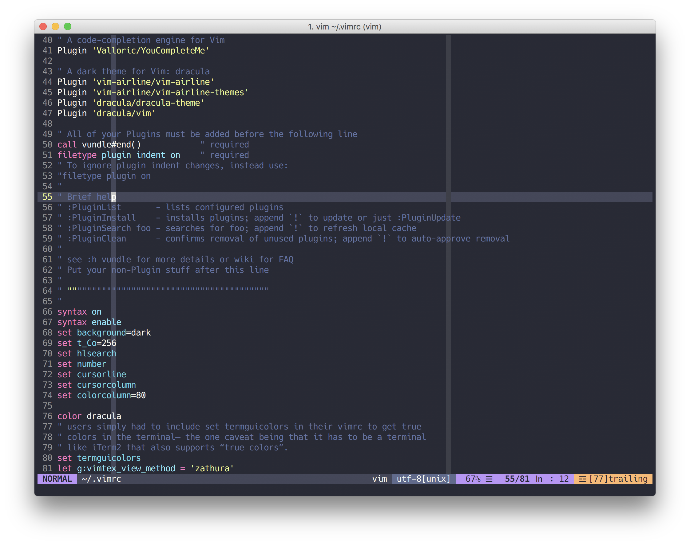
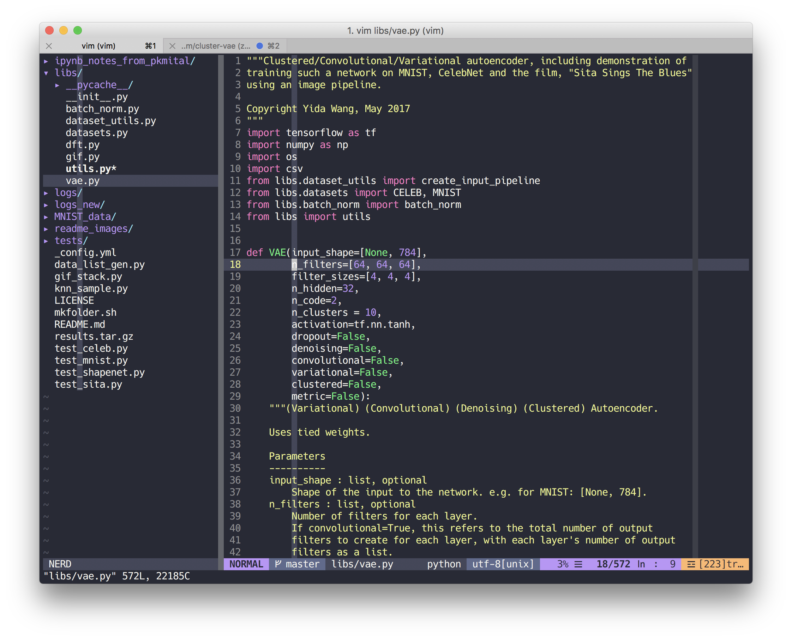
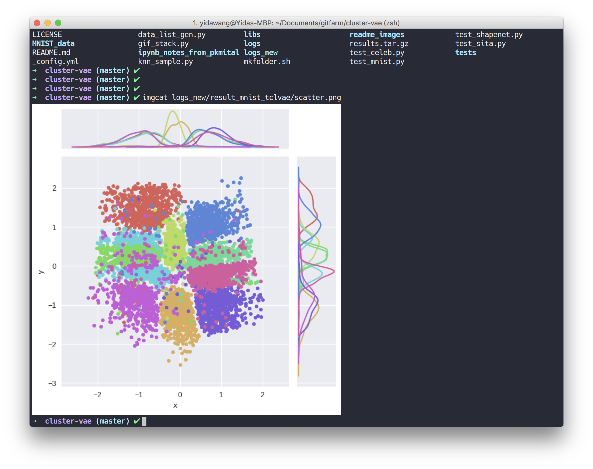
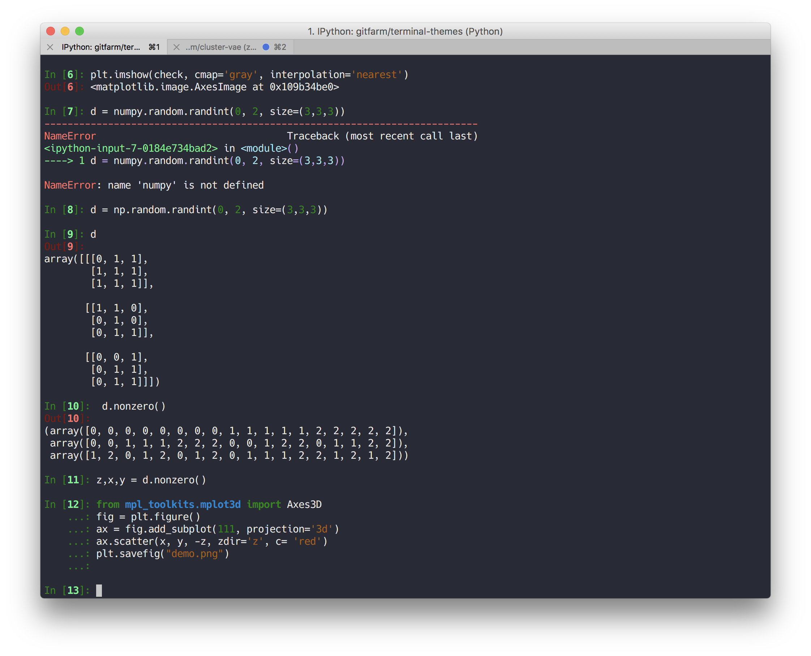

# Terminal Theme Modification
**Author**: Yida Wang
**Environments**: OS, Ubuntu and other Linux/Unix platform

Note that I adopt **Dracula** theme for every configureing files which is 
available in this [page](https://draculatheme.com/)


## VIM
Some themes in vim might not be available when the terminal supports true color, but you have not define this in **.vimrc**, In April Vim merged [patch 7.4.1799](https://groups.google.com/forum/#!topic/vim_dev/mAhjlVqpKts), which appears to simplify settings for using true colors in the terminal. After upgrading to this patch, users simply had to include set termguicolors in their vimrc to get true colors in the terminal– the one caveat being that it has to be a terminal like iTerm2 that also supports “true colors”.  

You should define this for Iterm:
```sh
" gui colors if running iTerm
if $TERM_PROGRAM =~ "iTerm"
  set termguicolors
endif
```

So vim will be something like this:


It also works well with editing with [YouCompleteMe](https://github.com/Valloric/YouCompleteMe), here is a python version for it.


## Tmux

## iTerm
You should have a test for determing whether the specific terminal like **iTerm** supports true color or not by executing:
```perl
perl test.pl
```
and the results will be something like this:


Here we can use the embeded function 
```sh
imgcat
``` 
in iTerm for perviewing images in terminal.


## Ipython
This theme also works for iPython kernels

