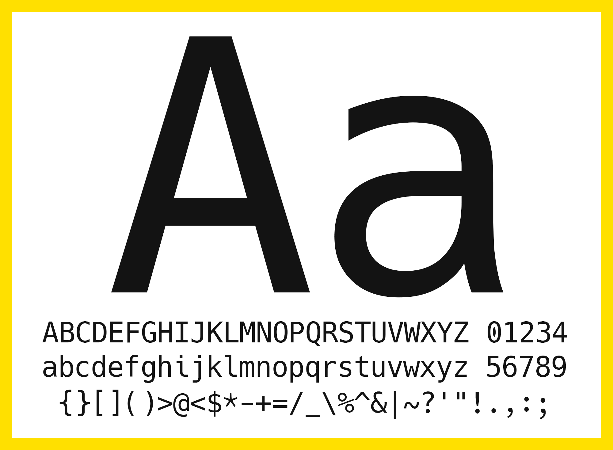
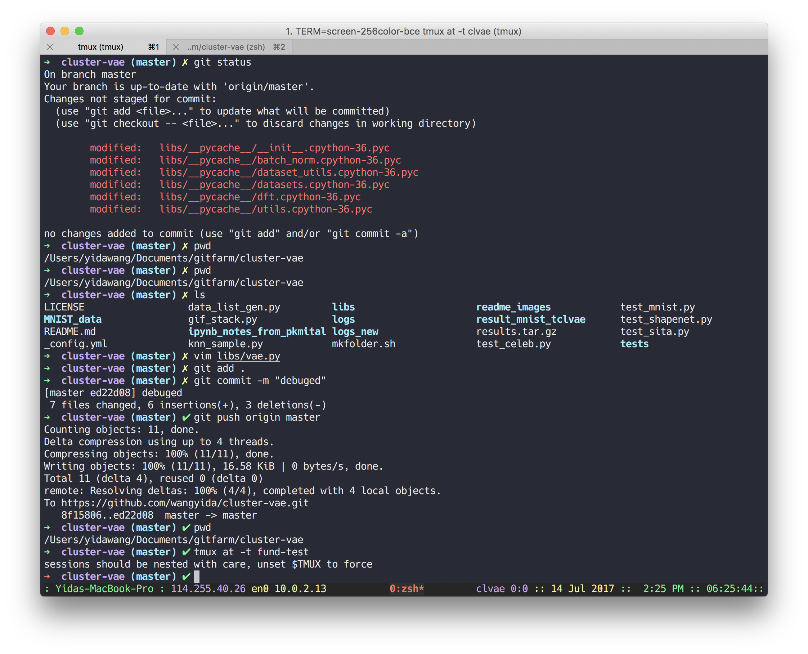
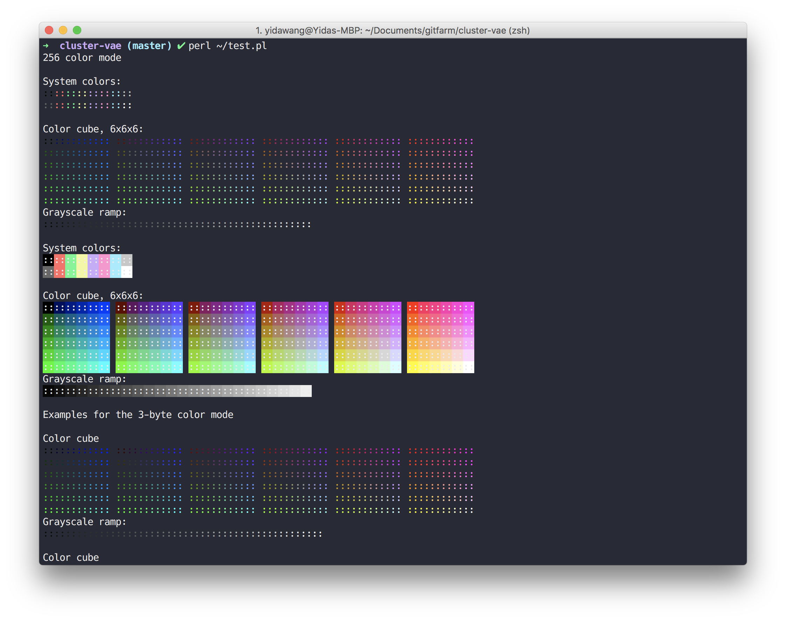
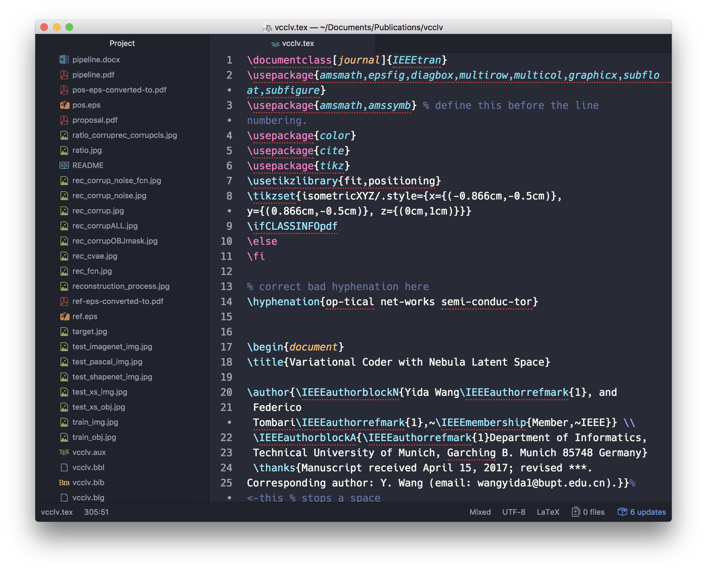

# Terminal Theme Modification

**Author**: Yida Wang

**Environments**: OS, Ubuntu and other Linux/Unix platform

## Installation

You can just install all those themes via
```sh
git clone https://github.com/wangyida/terminal-themes.git
cd terminal-themes
cp ./*rc* ~/
```

Pull request welcomed!!

## Theme

Note that I adopt **Dracula** theme for every configureing files which is 
available in this [page](https://draculatheme.com/)


## Font

### A typeface designed for source code

Hack is designed to be a workhorse typeface for code. It has deep roots in the libre, open source typeface community and expands upon the contributions of the [Bitstream Vera](https://www.gnome.org/fonts/) &amp; [DejaVu](http://dejavu-fonts.org/wiki/Main_Page) projects.  The project is in active development.  We welcome your input and contributions.



## Editors

### VIM

Some themes in vim might not be available when the terminal supports true color, but you have not define this in **.vimrc**, In April Vim merged [patch 7.4.1799](https://groups.google.com/forum/#!topic/vim_dev/mAhjlVqpKts), which appears to simplify settings for using true colors in the terminal. After upgrading to this patch, users simply had to include set termguicolors in their vimrc to get true colors in the terminal– the one caveat being that it has to be a terminal like iTerm2 that also supports “true colors”.


You should define this for Iterm:
```sh
" gui colors if running iTerm
if $TERM_PROGRAM =~ "iTerm"
  set termguicolors
endif
```

So vim will be something like this:


It also works well with editing with [YouCompleteMe](https://github.com/Valloric/YouCompleteMe), here is a python version for it.


### Tmux



### iTerm

You should have a test for determing whether the specific terminal like **iTerm** supports true color or not by executing:

```perl
perl test.pl
```
and the results will be something like this:


Here we can use the embeded function 

```sh
imgcat
``` 
in iTerm for perviewing images in terminal.


### ipython 

This theme also works for iPython kernels


### Atom


